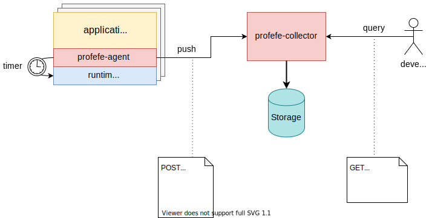
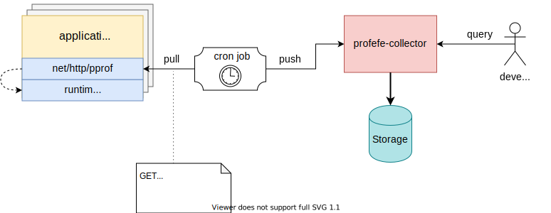

# Design

This is the working draft of the system design.

## Components

*profefe* consists of the following components

### Collector

(a.k.a. `cmd/profefe`)

A service that receives profiling data ([pprof-formatted](https://github.com/google/pprof/tree/6ce02741cba3adff4f8d4de07dc7a2379334cae4/doc),
i.e. `pb.gz`, or [Go runtime traces](https://golang.org/pkg/runtime/trace/)).
Collector persists the data in a plugable storage.
It also provides an API for querying and retrieving stored profiles.

Currently implemented storages:
- `storage/badger`, keeps data in [Badger DB](https://github.com/dgraph-io/badger);
- `storage/s3`, stores data in s3-compatible object storage service.

### Agent

An optional library, that can be integrated into an application instead of `net/http/prof`. The goal of agent is
to periodically scrap pprof data from the running application and to send the data to collector.

## Interaction

Below is the schema of profefe's components interaction:

If integrating the agent into the application is impossible or undesirable, but the application already exposes
`net/http/pprof` server, the pprof data can be scrapped using an external mechanism, that will send the data to
collector using its HTTP API.

In the following example, the agent was replaced with an external script that is running inside a cronjob. It
periodically requests profiling data from application's pprof server and sends it to collector:

